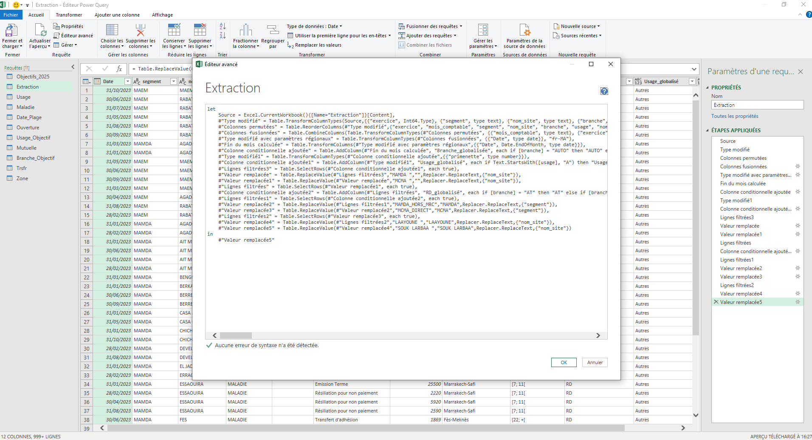
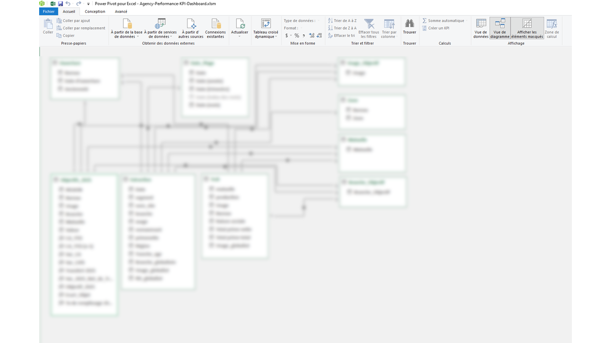
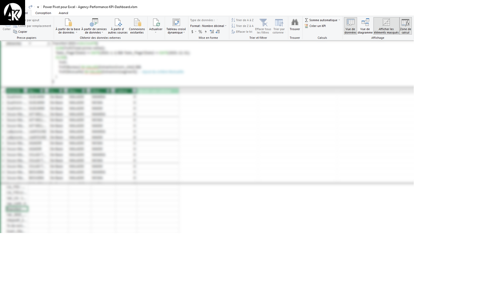
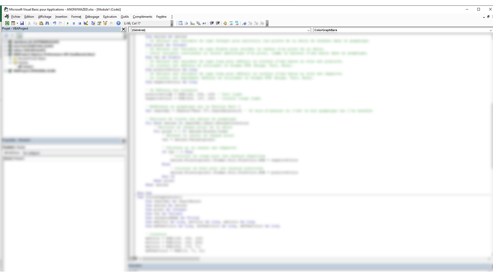
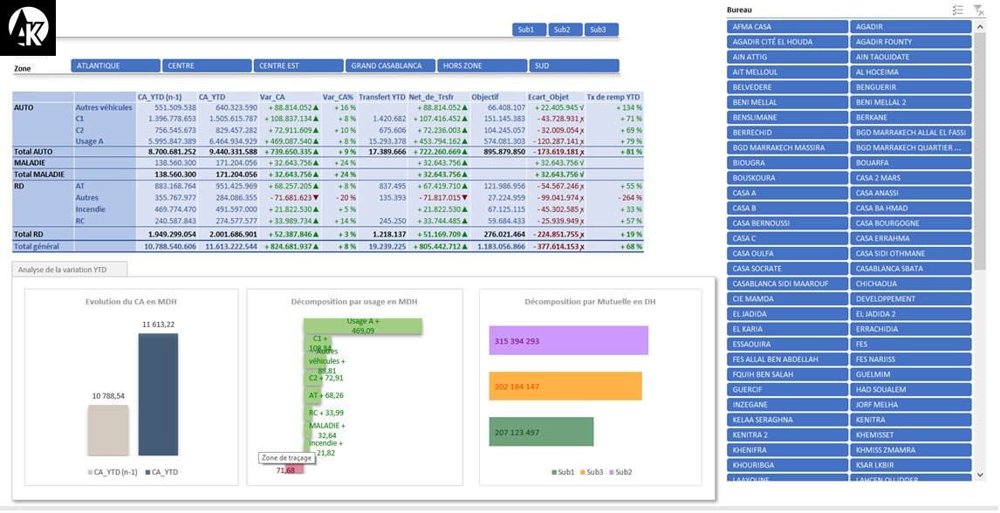
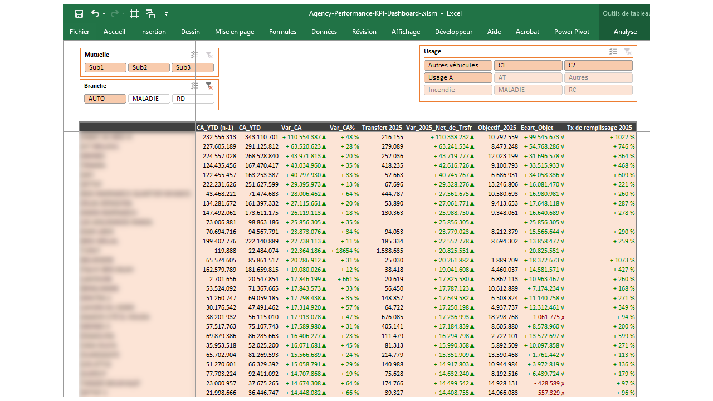

> 🔒 **Security & Privacy**  
> *This project reflects real business logic and real operational processes, but all data has been fully anonymized.*  
> *No identifiable or sensitive company information is included in this public version.*

### 📊 Agency Performance KPI Dashboard

📌 Project originally developed in a professional environment for performance monitoring across a network of multiple agencies.  
This public version has been fully anonymized and rebuilt to highlight my expertise in:  
**Power Query • Excel • PowerPivot • DAX • Data Modeling • Business Intelligence • KPI Automation.**

### 📊 Professional BI Dashboard built end-to-end for executive performance monitoring

---

### 🔗 Connect with Me  
[](https://www.linkedin.com/in/adil-k-06735123b/)

---

### 🎯 Recruiter-Focused Summary

This project demonstrates my ability to **design, build, automate, and maintain full Excel-based BI systems** for real operational decision-making.

Originally built for multi-agency performance tracking, this public version **recreates the entire logic and architecture**, while removing all sensitive data.

---

### 👤 My Role

I independently handled the full BI lifecycle:

- Requirements gathering with business teams  
- Designing KPIs & performance indicators  
- Building the data model (PowerPivot)  
- Developing ETL pipelines with Power Query  
- Implementing DAX calculations (YTD, YoY, variances)  
- Creating interactive dashboards and UX flows  
- Securing the Excel file (VBA protection, locked structure)  

➡️ Demonstrates my ability to build production-ready BI tools used by non-technical users.

---

### 🧩 1. End-to-End Data Workflow Ownership

I implemented the full workflow:

- **Extract →** SQL, CSV, Excel  
- **Transform →** Power Query (M)  
- **Load →** PowerPivot  
- **Model →** Star Schema  
- **Calculate →** DAX KPIs  
- **Automate →** VBA  
- **Visualize →** Excel dashboards  

➡️ Full ownership from raw data to decision-ready KPIs.

---

### 🗄️ 2. Data Sources & ETL Architecture (Two Fact Tables)

This project integrates **multiple real-world data sources**, including **two fact tables** and several dimensions.

---

### 🔹 FACT TABLE 1 — SQL Source (Primary)
Loaded via a SQL query, containing:

- Turnover (CA / Primenette) — monthly net premium amounts  
- Monthly historical data — using mois_comptable for time-series analysis
- Yearly aggregation support — raw data allows annual totals by exercise
- 3-year rolling analysis support — enough historical depth to compute rolling multi-year performance
- Operational segmentation — segment, nom_site, branche, Région
- Product usage and contract type — usage, nomavenant
- Age-group slicing — Tranche_age for demographic analytics

SQL ensures reliable, validated operational data.

---

### 🔹 FACT TABLE 2 — CSV Source (Secondary)
Imported via Power Query from an internal PHP-based web application that exports operational reports in CSV format.
This secondary dataset provides complementary transfer-related information that is not available in the primary SQL source, including:

- Subsidiary (e.g., Sub1)
- Production type (e.g., AUTO)
- Usage category (e.g., AXX, D11)
- Bureau / Agency  
- Transfer details  
- Usage decomposition  
- Net premium amounts (Total prime nette)  

All CSV data is cleaned, standardized, and aligned with the SQL fact table through normalization rules to ensure full consistency and reliable cross-source consolidation.

---

### 🔹 Dimension Tables — Excel

Multiple Excel-based DIM tables support filtering, relationships, and data harmonization across the model, including:

- Subsidary
- Branche (Product line)
- Zone / Region
- Bureau (Agency)
- Usages & Usage Codes  
- Objective/Target reference tables  
- Standardization and mapping rules
 
These dimension tables ensure consistent filtering, accurate joins, and unified business definitions across all fact tables.

---

### 🔹 Power Query ETL Workflow

Power Query handles:

- Cleaning & normalizing raw data  
- Merging multi-source datasets  
- Applying parametric transformations  
- Renaming, mapping, and standardizing outputs  
- Error prevention & data consistency  
- Reproducible transformations  

📷 Power Query Editor  


---

### 🧩 3. Robust Data Model (PowerPivot)

A clean and optimized **star schema**:

- FACT_CA (SQL)  
- FACT_Support (CSV)  
- Dimension tables (Excel/CSV)  

Highlights:

- One-to-many relationships  
- Optimized cross-filtering  
- Performance-oriented modeling  

📷 Data Model Overview  


---

### 🧩 4. Advanced DAX Measures

Includes:

- CA_YTD  
- YoY Variance  
- Variance %  
- Objective vs Real  
- Usage decomposition  
- Mutuelle decomposition

📷 DAX Measures Screenshot  


---

### 🔧 5. VBA Automation & Workbook Security

This project includes advanced VBA modules to automate and secure the dashboard.

### 🔒 Workbook & Dashboard Protection

- Allows slicer interaction  
- Locks shapes & objects  
- Prevents editing PivotTables  
- Protects workbook structure  

### 🔄 Automated Refresh Logic

- Uses `IsUpdating` flag  
- Controls update cycle  
- Prevents conflicts during refresh  

### 🎨 Dynamic Chart Formatting

Automatically applied based on KPI context:

- Positive values → green  
- Negative values → red  
- **Mutuelle colors follow brand identity (Sub2, Sub1, Sub3)**  
- Circular chart enhancements  
- Automated label formatting  

### 🗂 Hidden Sheet & UX Management

- Controlled scroll area  
- Secure navigation  
- Unhides sheets only when required  

📷 VBA Module Overview  


---

### 📈 Dashboard Overview

### 🌐 Main KPI Dashboard

- Multi-criteria filtering  
- KPIs: CA_YTD, Var_CA, Var_%, Transfers, Objectives  
- Color-coded performance indicators  
- Multi-agency comparison  

📷 Dashboard KPI Overview  


---

### 🗂 Detailed Agency Breakdown

- Bureau-level KPIs  
- Transfer impact analysis  
- Objective tracking  
- KPI performance signals  

📷 Detailed Agency View  


---

### 🧠 Technical Summary

### 🔧 Technical BI Skills  
Power Query (M) • PowerPivot • DAX • Excel Automation (VBA) • SQL • ETL • Data Quality • Optimization

### 📊 Analytics Expertise  
KPI engineering • YTD/YoY logic • Variance analysis • Multi-dimensional slicing

### 🏢 Professional Delivery  
Clean architecture • Real business logic • Documentation • UX for executives

---

# 📁 Project Structure

```
/images
   PowerQuery_Editor.png
   Dashboard_kpi_overview.png
   Dashboard_image_nd.png
   Dashboard_agency_details.png
   model_data_powerpivot.png
   DAX_Model.png
   KPI_Dashboard_VBA_Module.png

LICENSE
README.md
```

---

> ### 📄 Full Version Availability
> Screenshots and a video demo are provided to showcase the architecture and features.
> 
>➡️ **The full working Excel file can be shared upon request for recruitment purposes only.**  
>It remains protected under the **CC BY-NC-ND 4.0 license**.

---

# 👨‍💻 Author 
 
**Adiliscoder**  
Business Intelligence Developer / Data Analyst  
Excel • PowerQuery • PowerPivot • DAX • SQL • Python • ETL
